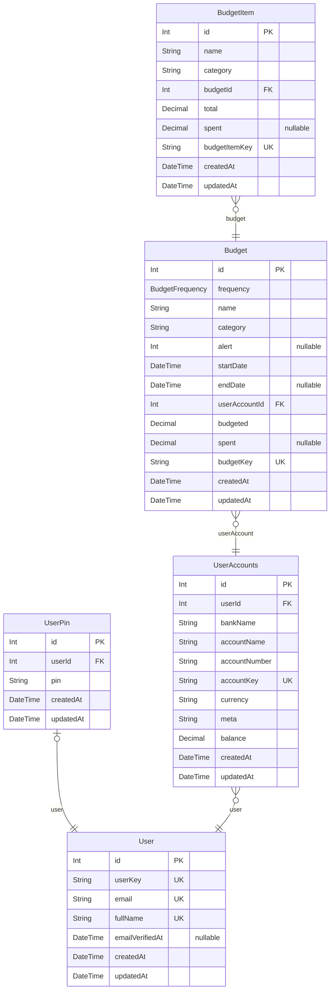

# MonieTracker
> Generated by [`prisma-markdown`](https://github.com/samchon/prisma-markdown)

- [default](#default)

## default

### `User`

**Properties**
  - `id`: 
  - `userKey`: 
  - `email`: 
  - `fullName`: 
  - `emailVerifiedAt`: 
  - `createdAt`: 
  - `updatedAt`: 

### `UserPin`

**Properties**
  - `id`: 
  - `userId`: 
  - `pin`: 
  - `createdAt`: 
  - `updatedAt`: 

### `UserAccounts`

**Properties**
  - `id`: 
  - `userId`: 
  - `bankName`: 
  - `accountName`: 
  - `accountNumber`: 
  - `accountKey`: 
  - `currency`: 
  - `meta`: 
  - `balance`: 
  - `createdAt`: 
  - `updatedAt`: 

### `Budget`

**Properties**
  - `id`: 
  - `frequency`: 
  - `name`: 
  - `category`: 
  - `alert`: 
  - `startDate`: 
  - `endDate`: 
  - `userAccountId`: 
  - `budgeted`: 
  - `spent`: 
  - `budgetKey`: 
  - `createdAt`: 
  - `updatedAt`: 

### `BudgetItem`

**Properties**
  - `id`: 
  - `name`: 
  - `category`: 
  - `budgetId`: 
  - `total`: 
  - `spent`: 
  - `budgetItemKey`: 
  - `createdAt`: 
  - `updatedAt`: 